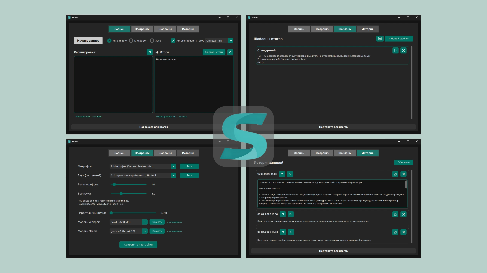

  

# Squire - локальный транскрибатор с итогами записей по шаблонам

Версия: 0.1.4

  

## Возможности

- Онбординг
- Запись с микрофона и системного звука (или микс)
- Live-транскрипция (Whisper)
- Генерация структурированных итогов через Ollama (gemma3:4b или другие модели)
- Автогенерация итогов после остановки записи (опционально)
- Управление шаблонами итогов (создание, редактирование, удаление)
- История записей с сохранением расшифровок и итогов

## Требования
- [Релизная сборка](https://github.com/S1neman/squire/releases) в .exe уже включает в себя ffmpeg, понадобится только скачать ollama и whisper.
 ОС: Windows 10-11
 RAM: 4 ГБ для малых моделей, 8–16 ГБ для больших
 SPACE: Squire.exe (~500Mb с ffmpeg), Whisper small (~500Mb), Ollama (~4Gb gemma3:4b)
 Total space: ~5Gb
  **<ins>При отсутствии распознавания системного звука потребуется включить "Стерео микшер" в настройка звука Windows.</ins>**

- **Whisper** – можно будет скачать прямо в интерфейсе Squire
 Список моделей ограничен списком ниже (оптимально small):

| Модель      | Вес         |
|-------------|-------------|
| tiny        | ~75 MB      |
| base        | ~150 MB     |
| small       | ~500 MB     |
| medium      | ~1.5 GB     |
| large-v3    | ~3 GB       |

- **[Ollama](https://ollama.com/download)** – установить и запустить сам сервер, скачать модели можно в Squire
 Список моделей ограничен списком ниже (оптимально gemma3:4b):

| Модель      | Вес         |
|-------------|-------------|
| gemma3:1b   | ~1 GB       |
| gemma3:4b   | ~4 GB       |
| qwen3.5:4b  | ~4 GB       |

- **[FFmpeg](https://ffmpeg.org/download.html)** – если уж потерялся, то скачать и положить `ffmpeg.exe` в папку с программой (или добавить в PATH)

## Установка (для разработчиков)
- **Python 3.12**
1. Клонировать репозиторий
2. Создать виртуальное окружение: `python -m venv venv`
3. Активировать: `venv\Scripts\activate`
4. Установить зависимости: `pip install -r requirements.txt`
5. Запустить: `python main.py`

## Использование

- **Запись**: выберите режим (микрофон/звук/микс), нажмите "Начать запись". При остановке транскрипция завершается. Если включена автогенерация, итоги(саммари) создаются автоматически.
- **Шаблоны**: создавайте свои шаблоны для генерации итогов (используйте `{text}` для подстановки расшифровок).
- **Настройки**: выберите аудиоустройства, отрегулируйте вес источников и порог тишины, скачайте модели.
- **История**: просмотр, копирование, удаление записей.

## Лицензия

MIT
